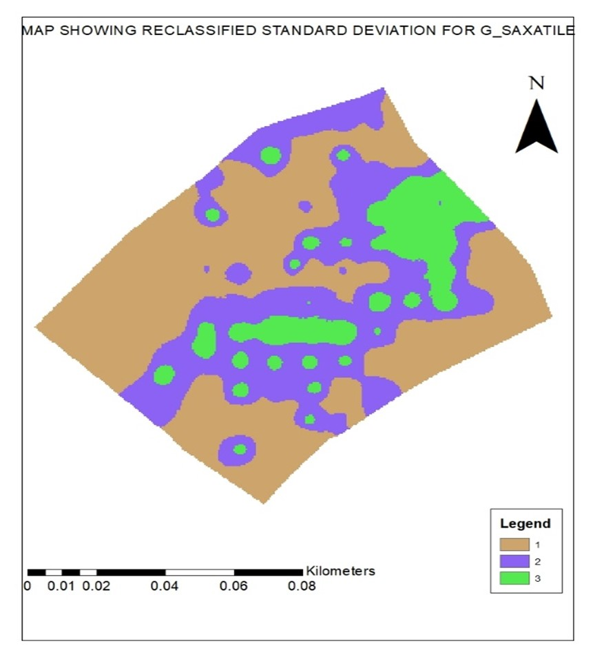
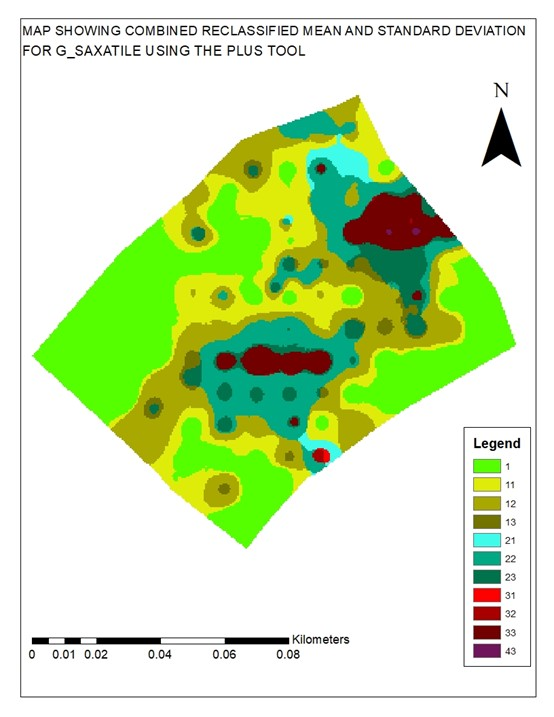
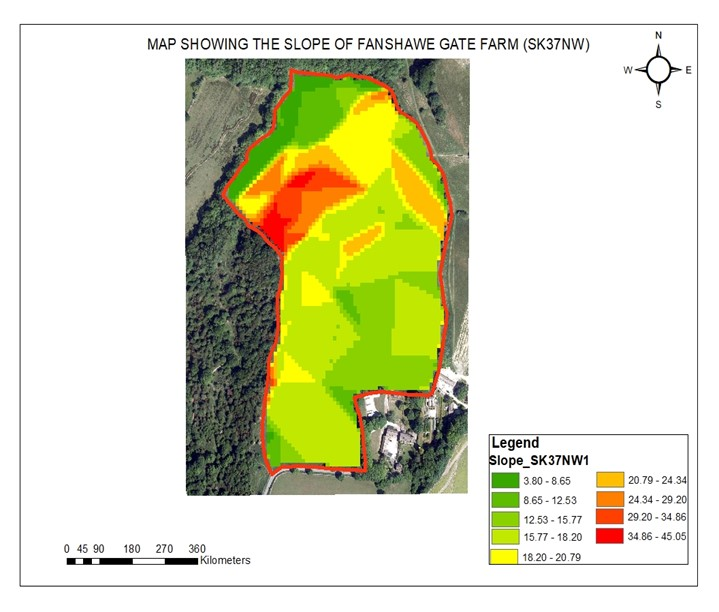
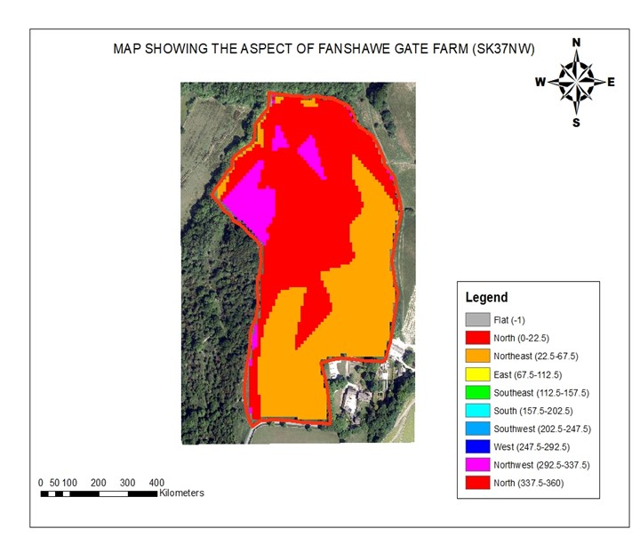
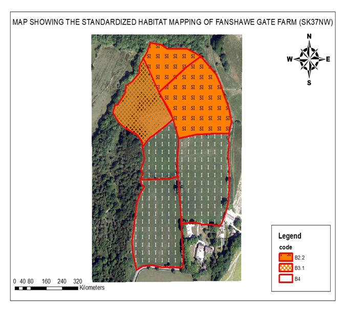

# 🌍 GIS Environmental Analysis of Fanshawe Gate Farm

## 📌 Project Overview
This project demonstrates how Geographic Information Systems (GIS) can be used to analyze environmental features at Fanshawe Gate Farm (Sheffield, UK).  

The study integrates terrain analysis, habitat classification, vegetation mapping, and spatial interpolation to understand environmental patterns and species distribution.

📄 Full Report: See attached document in repository

---

## 🎯 Objectives
- Analyze terrain using slope and aspect  
- Map habitats using Phase 1 classification  
- Model species distribution using interpolation  
- Detect spatial and temporal changes  
- Support environmental management decisions  

---

## 🛠️ Tools & Data
- **Software:** ArcGIS 10.6.1  
- **Data Sources:** Digimap OS Terrain 5, aerial imagery  
- **Techniques Used:**
  - DEM (Digital Elevation Model)
  - Slope & Aspect analysis
  - Phase 1 Habitat Mapping
  - Inverse Distance Weighting (IDW)
  - Raster reclassification & overlay

---

## 🗺️ Study Area
Fanshawe Gate Farm is located near Holmesfield, Sheffield. The farm is managed under environmental stewardship schemes and provides a suitable case study for GIS-based ecological analysis.

---

# 📊 RESULTS & MAPS

## 1. Species Distribution (2004)
This map shows the raw distribution of *Galium saxatile* using point data.

🔍 Insight:
- Data is discrete and does not show spatial trends clearly  
- Requires interpolation for deeper analysis  

---

## 2. Interpolation (IDW Technique)
This map shows interpolated species distribution using inverse distance weighting.

🔍 Insight:
- Reveals hotspots of species concentration  
- Based on spatial autocorrelation principle  
---

## 4. Standard Deviation (3 Years)
Shows variability in species distribution over time.

🔍 Insight:
- High values = unstable or changing areas  
- Low values = stable regions  

---

## 5. Reclassified Standard Deviation
Simplifies variability into categories.

🔍 Insight:
- Makes interpretation easier  
- Highlights zones of concern  

---

## 6. Combined Mean + Standard Deviation
Final analysis combining raster layers using the PLUS tool.

🔍 Insight:
- Identifies stable vs dynamic ecological zones  
- Supports decision-making  

---

## 7. Slope Analysis
Shows terrain steepness across the farm.

🔍 Insight:
- Green = flat areas (suitable for grazing)  
- Red = steep areas (erosion risk)  

---

## 8. Aspect Analysis
Shows direction of slope (sun exposure).

🔍 Insight:
- Influences vegetation growth  
- Affects moisture and sunlight  

---

## 9. Habitat Mapping (Phase 1 Classification)
Shows classified habitats across the farm.

🔍 Insight:
- Identifies improved, semi-improved, and natural habitats  
- Supports conservation planning  

---

# 📈 DISCUSSION

- Slope analysis highlights erosion-prone zones  
- Aspect influences vegetation distribution  
- Habitat mapping shows dominance of grassland  
- IDW interpolation effectively reveals spatial patterns  
- Change detection identifies ecological trends over time  

GIS allows integration of multiple datasets to support environmental analysis and planning.

---

# ⚠️ LIMITATIONS
- Slope and aspect simplify terrain representation  
- Phase 1 classification lacks detailed ecological resolution  
- Interpolation assumes spatial relationships  
- Possible digitizing and georeferencing errors  

---

# ✅ CONCLUSION
GIS techniques successfully supported the analysis of environmental features at Fanshawe Gate Farm.  

The study demonstrates how GIS can:
- Identify ecological patterns  
- Monitor environmental change  
- Support sustainable land management  

---

# 📂 REPOSITORY STRUCTURE
